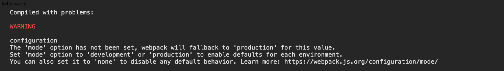

# 从零开始配置webpack开发react   
最近不知道学点什么，寻思了一下`webpack`好像是一个不会过时的话题，加上本人迫切需要培养文档能力，所以就把一些学习过程记录下来；写webpack的文章应该是很多了，我的出发点是从一个没有接触过`webpack`的人的角度，按照步骤比较细致地描述过程，尽量做到依赖都有来源和依据可寻，应该会适合刚接触使用`webpack`的人，所有过程会以commit的形式提交到[github](https://github.com/zotille/config-webpack)中，主要参考方向是[create-react-app](https://github.com/facebook/create-react-app)。   

   

---
## 使用webpack生成一个页面
### **`目标`** 
使用尽量少的代码，实现能够实现最简单的页面运行，既然是最简单的，那就是不包含react的；
### **`要素`** 
- 初始化项目
- `webpack` 基础依赖安装
- `webpack.config.js` webpack的配置文件；
- `index.js` 开发使用的代码入口；
### **`步骤`**
1. 首先需要新建一个目录并且初始化一个项目，我的项目就在文档的文件夹里面，所以直接在文件夹里面执行`npm init -y`生成`package.json`，项目中使用的包管理工具为`yarn`。
2. 安装使用webpack必须的依赖
    ```
    yarn add -D webpack webpack-cli html-webpack-plugin
    ```
- [webpack-cli](https://github.com/webpack/webpack-cli/tree/master/packages/webpack-cli)
  是直接运行`.bin/webpack`可执行代码的必须依赖<[什么是bin](https://docs.npmjs.com/cli/v7/configuring-npm/package-json#bin)>，在命令行运行webpack时，会首先检查是否安装了这一依赖；   
     
  如果没有安装依赖，在执行webpack的时候，会提示你缺少依赖：
     
- [html-webpack-plugin](https://webpack.js.org/plugins/html-webpack-plugin/)
  能够把打包后的js文件插到html中，由于浏览器需要一个页面作为入口，因此依赖这个插件打包后的代码能够在浏览环境中打开；

3. 建立js的入口文件以及webpack的config文件，在项目的根目录创建以下文件：
    ```
    /
    ┣ src/
    ┃ ┗ index.js
    ┗ webpack.config.js
    ```
    以下为实现页面运行的最基本webpack配置
    ```
    const path = require("path");
    const HtmlWebpackPlugin = require("html-webpack-plugin");

    module.exports = {
      entry: path.join(__dirname, "src", "index.js"),
      output: {
        filename: "main.js",
      },
      plugins: [new HtmlWebpackPlugin()],
    };
    ```
    这个配置文件指定了js的入口文件为`src/index.js`，并且打包后会输出一个名为`main.js`的文件，注意这里并没有创建`index.html`，这是因为`html-webpack-plugin`插件支持通过template参数传入html模板，但是如果没有指定模板，则会使用默认的模板内容;
    另外，为了验证js文件已经执行，我会在html中插入一段文本，并在`src/index.js`中从控制台输出：
    ``` javascript
    document.body.innerText = 'Hello World!';
    console.log('Hello World!');
    ```

4. 运行代码
   运行webpack有很多种方式，最常见的应该是在`package.json`的脚本中添加脚本执行编译，除此之外还有一些其他
   1. 在命令行直接执行webpack的bin文件`./node_modules/.bin/webpack build`;
   2. 使用`npx webpack build`执行编译；
   3. 在vscode中增加调试配置，通过调试工具运行代码，支持断点，方便调试与重启
    ```
    {
      "version": "0.2.0",
      "configurations": [
        {
          "type": "node",
          "request": "launch",
          "name": "webpack",
          "runtimeExecutable": "node",
          "runtimeArgs": [
            "./node_modules/.bin/webpack"
          ]
        }
      ]
    }
    ```
    这些方式的本质都是执行了`webpack`的可执行脚本，为了方便在我配置的过程中都是使用第三种方法进行调试；在执行编译之后，会在`dist`文件夹下生成以下文件：
    ```
    dist/
    ┣ index.html
    ┗ main.js
    ```   
    将`index.html`拖到浏览器中直接打开，得到运行后的结果如下：
       
    可以看到我们的js文件已经被html引用并且成功执行，另外这个默认的html内容就是在未指定模板的情况下，`html-webpack-plugin`给出的默认html。

## 使用webpack开发react
---
### **`目标`** 
使代码能够支持运行react代码，并且实现自动更新
### **`要素`** 
- `react`以及`react-dom`依赖；
- `babel`以及`webpack`的配置；
- `webpack-dev-server` 插件；

### **`步骤`** 
1. 安装react依赖
   ```
   yarn add react react-dom
   ```
    `react`为运行react的必须依赖，[react-dom](https://reactjs.org/docs/react-dom.html)提供了将react代码渲染到DOM元素上的能力；我们一般使用类似于以下的代码形式，将一个react元素挂载到网页上的指定元素中，我们直接在`src/index.js`中书写react代码：
    ``` javascript
    import React from 'react';
    import ReactDOM from 'react-dom';

    ReactDOM.render(<div>Hello World!</div>, document.body)
    ```
    如果我们直接执行以上代码，`webpack`会输出以下错误信息：   
       
  
    这是因为`import`是一种ES6的语法，这里`webpack`没有办法对其进行处理，因此我们需要`babel`帮助我们进行处理，其实在这一步可以预见的是，在没有进行特殊处理的时候，`webpack`是没有办法识别`jsx`语法的：   
      
    因此这次我们一起安装`babel`所需基础依赖：
    ```
    yarn add -D babel-loader
    yarn add -D @babel/{core,preset-env,preset-react}
    ```
     - [babel](https://babeljs.io/)的作用是对代码进行转义，把千奇百怪的js语言装换为浏览器可执行的代码，[@babel/core]()；[@babel/preset-env](https://babeljs.io/docs/en/babel-preset-env)，通过设定参数，可以实现代码以及浏览器兼容范围指定，实现打包后代码的体积优化等，当不提供参数时，babel会将所有代码转换为ES5语法的代码；
     - [babel-loader](https://github.com/babel/babel-loader)让webpack拥有使用babel的能力，是在webpack中使用`babel`的基础；   
     - [@babel/preset-react](https://babeljs.io/docs/en/babel-preset-react)提供react的语法支持，反正没有这玩意就会报错说解析不到jsx语法的代码 - -；   
    之后，我们按照文档，更新webpack配置:
    ```
    module.exports = {
    ...
      module: {
        rules: [
          {
            test: /\.?js$/,
            exclude: /node_modules/,
            use: {
              loader: "babel-loader",
              options: {
                presets: ["@babel/preset-env","@babel/preset-react"],
              },
            },
          },
        ],
      },
    };
    ```
    再次执行代码，就在`dist`文件夹下生成了大小为130kB的main.js，说明配置已经生效
2. 增加html入口以及dev-server
   虽然由于不指定模板时，`HtmlWebpackPlugin`会使用默认的模板，但是这样很不利于我们对html的内容做样式和内容的定制，所以这一步会在src文件夹下新建一个`index.html`作为新的入口，这里我的html内容是：
    ```
    <!DOCTYPE html>
    <html lang="en">
      <head>
        <meta name="viewport" content="width=device-width, initial-scale=1.0" />
        <title>Learn Webpack</title>
      </head>

      <body>
        <div id="zotille"></div>
      </body>
    </html>
    ```
    `<div id="zotille"></div>`是一个好找的DOM元素，方便react挂载元素；接下来我们需要在`src/index.js`中更新react挂载的节点，把代码更新成：
    ```
    import React from "react";
    import reactDom from "react-dom";

    reactDom.render(<div>hello world</div>, document.getElementById("zotille"));
    ```
    这里实现的就是将一个内容为hello world的div元素挂载到DOM中id为zotille的元素上，如果你愿意，也可以挂载到任何元素上；下面将html入口文件配置到webpack中：
    ```
    module.exports = {
      ...
      plugins: [new HtmlWebpackPlugin({
        template: path.resolve(__dirname, 'src/index.html')
      })],
      ...
    ```
    再次运行编译，得到编译后的页面：   
    

3. 显然，开发的时候我们是不希望一边更改代码一边刷新页面的，因此我们就要用到[webpack-dev-server](https://webpack.js.org/configuration/dev-server/)，使用DevServer可以检测代码变化，进行实时编译，并通过端口访问页面内容，使用`yarn add -D webpack-dev-server`之后，我们可以使用`npx webpack server`开启任务，或者在调试设置中增加参数：
  ``` json
  ...
  "runtimeArgs": [
        "./node_modules/.bin/webpack",
        "server"
      ]
  ...
  ```
  `webpack-dev-server`的默认端口为8080，也可已通过参数进行指定，在完成以上步骤之后，在浏览器中打开，http://127.0.0.1:8080，发现以下错误信息：
  ，这是因为我们在之前没有设置webpack的运行模式，因此在production模式下，webpack会将所有的warning信息显示在页面上，所以我们更新webpack配置中的运行模式配置：
  ```
  ...
  mode: "development"
  ```
再次运行代码，就得到了正常的页面，此时如果再修改index.js中的内容，页面就会自动重新加载。

