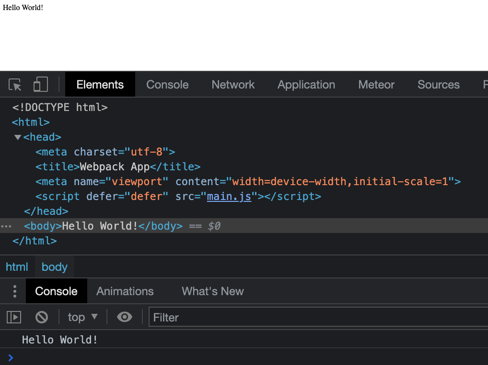

## 使用webpack生成一个页面
### **`目标`** 
使用尽量少的代码，实现能够实现最简单的页面运行，既然是最简单的，那就是不包含react的；
### **`要素`** 
- 初始化项目
- `webpack` 基础依赖安装
- `webpack.config.js` webpack的配置文件；
- `index.js` 开发使用的代码入口；
### **`步骤`**
1. 首先需要新建一个目录并且初始化一个项目，我的项目就在文档的文件夹里面，所以直接在文件夹里面执行`npm init -y`生成`package.json`，项目中使用的包管理工具为`yarn`。
2. 安装使用webpack必须的依赖
    ```
    yarn add -D webpack webpack-cli html-webpack-plugin
    ```
- [webpack-cli](https://github.com/webpack/webpack-cli/tree/master/packages/webpack-cli)
  是直接运行`.bin/webpack`可执行代码的必须依赖<[什么是bin](https://docs.npmjs.com/cli/v7/configuring-npm/package-json#bin)>，在命令行运行webpack时，会首先检查是否安装了这一依赖；   
     
  如果没有安装依赖，在执行webpack的时候，会提示你缺少依赖：
     
- [html-webpack-plugin](https://webpack.js.org/plugins/html-webpack-plugin/)
  能够把打包后的js文件插到html中，由于浏览器需要一个页面作为入口，因此依赖这个插件打包后的代码能够在浏览环境中打开；

3. 建立js的入口文件以及webpack的config文件，在项目的根目录创建以下文件：
    ```
    /
    ┣ src/
    ┃ ┗ index.js
    ┗ webpack.config.js
    ```
    以下为实现页面运行的最基本webpack配置
    ```
    const path = require("path");
    const HtmlWebpackPlugin = require("html-webpack-plugin");

    module.exports = {
      entry: path.join(__dirname, "src", "index.js"),
      output: {
        filename: "main.js",
      },
      plugins: [new HtmlWebpackPlugin()],
    };
    ```
    这个配置文件指定了js的入口文件为`src/index.js`，并且打包后会输出一个名为`main.js`的文件，注意这里并没有创建`index.html`，这是因为`html-webpack-plugin`插件支持通过template参数传入html模板，但是如果没有指定模板，则会使用默认的模板内容;
    另外，为了验证js文件已经执行，我会在html中插入一段文本，并在`src/index.js`中从控制台输出：
    ``` javascript
    document.body.innerText = 'Hello World!';
    console.log('Hello World!');
    ```

4. 运行代码
   运行webpack有很多种方式，最常见的应该是在`package.json`的脚本中添加脚本执行编译，除此之外还有一些其他
   1. 在命令行直接执行webpack的bin文件`./node_modules/.bin/webpack build`;
   2. 使用`npx webpack build`执行编译；
   3. 在vscode中增加调试配置，通过调试工具运行代码，支持断点，方便调试与重启
    ```
    {
      "version": "0.2.0",
      "configurations": [
        {
          "type": "node",
          "request": "launch",
          "name": "webpack",
          "runtimeExecutable": "node",
          "runtimeArgs": [
            "./node_modules/.bin/webpack"
          ]
        }
      ]
    }
    ```
    这些方式的本质都是执行了`webpack`的可执行脚本，为了方便在我配置的过程中都是使用第三种方法进行调试；在执行编译之后，会在`dist`文件夹下生成以下文件：
    ```
    dist/
    ┣ index.html
    ┗ main.js
    ```   
    将`index.html`拖到浏览器中直接打开，得到运行后的结果如下：
       
    可以看到我们的js文件已经被html引用并且成功执行，另外这个默认的html内容就是在未指定模板的情况下，`html-webpack-plugin`给出的默认html。
