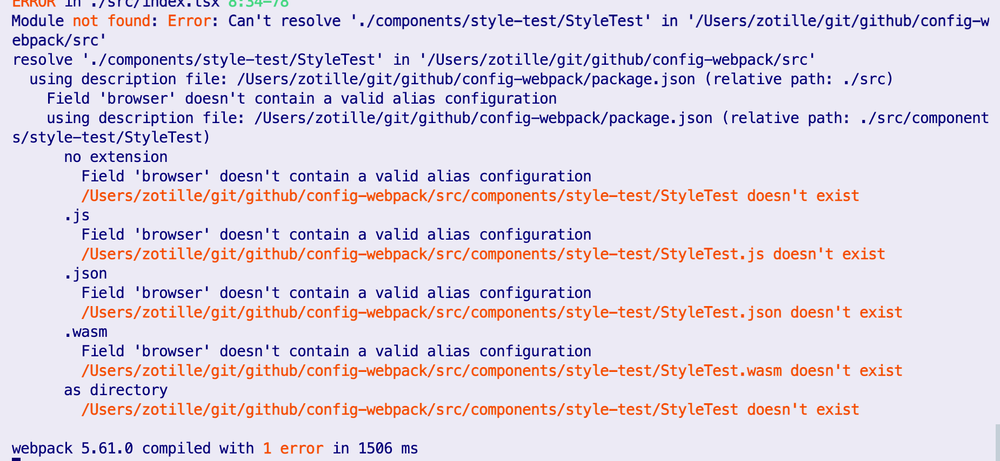

## 使用typescript开发项目
没有耐心直接看[小结](#小结)
### **`目标`** 
- 使用`typescript`写react代码；
- 使用`typescript`进行webpack配置；
### **`要素`** 
- 使webpack能够正确解析ts代码；
- 使webpack能够正确读取使用`.ts`书写的配置并运行；
### **`步骤`** 
### 1.尝试使用ts书写代码
 - 将js入口文件后缀名更改为`index.tsx`，并将webpack配置中的入口文件指定为新的文件，重新运行程序，得到以下报错：

webpack又缺少对应的loader了，所以我们需要为webpack增加`ts-loader`使它能够正确解析ts文件，当然为了能够正确使用typescript的功能，我们需要同时添加typescript的依赖
    ```
    yarn add -D ts-loader typescript
    ```
    并在配置文件中启用：
    ``` javascript
    module: {
      rules: {
        { test: /\.tsx?$/, loader: "ts-loader" },
      }
    }
    ```
  - 再次启动程序，得到以下报错：
    
    这是因为typescript的运行需要对应的[配置文件](https://www.typescriptlang.org/docs/handbook/tsconfig-json.html)才能运行，目前我们只需要通过命令行`tsc --init`,在项目中生成默认的`tsconfig.json`文件
  - 再次运行代码，会发现ts已经正确检查代码中的ts错误：
    
    很遗憾，目前的react包中并不包含对应的描述文件，所以我们需要手动安装缺失的描述文件
    ```
    yarn add -D @types/{react,react-dom}
    ```
  至此，再次运行代码，应该能够很顺利的启动项目了
  - 但是当我们尝试引入其他组件的时候，ts会报出以下错误
    
    因为webpack无法正确解析对应的后缀名，因此我们需要在`webpack`配置中增加对应的文件后缀名，告诉`webpack`需要接续的文件后缀：
    ```
    ...
    resolve: {
      extensions: [".ts", ".tsx", ".js", ".json", ".wasm"],
    },
    ...
    ```
    这样，使用ts配置的项目才能够正确运行
### 2.使用ts配置webpack
  **这是一个比较激进的策略**，但是ts的代码提示能够帮助我们更好地进行代码配置；
1. 首先将`webpack`的配置文件名更改为`webpack.config.ts`，将配置的声明更改为：
    ```
    import { Configuration } from 'webpack'
    const path = require("path");
    const HtmlWebpackPlugin = require("html-webpack-plugin");

    const config: Configuration = {
      ...
    }

    export default config;
    ```
2. 此外，为了方便调试，我们将在`package.json`中增加脚本内容`"dev": "npx ts-node ./node_modules/.bin/webpack server"`方便我们进行调试；之后在命令行使用`yarn dev`运行项目。

### 小结
要正确配置`typescript`，需要至少经历以下几个步骤：
1. 增加对应的loader支持；
2. 增加支持ts运行的 `tsconfig.json`文件；
3. 增加描述文件支持（也可以选择忽略）；
4. 增加解析后缀名配置
